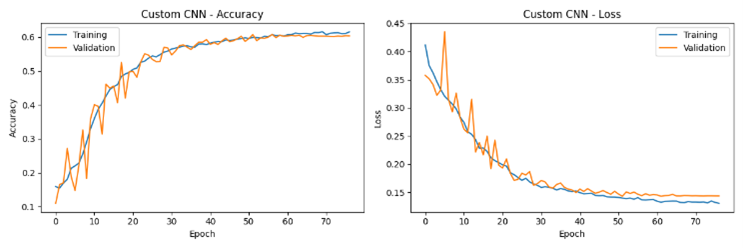

# Emotion Recognition From Facial Images With CNNs

## Project Overview

This project explores Facial Expression Recognition (FER) using Convolutional Neural Networks (CNNs) applied to the FER2013 dataset. The primary objective was to evaluate and compare the effectiveness of three different CNN-based models: a Custom CNN, MobileNetV2 with head-only training, and a fine-tuned MobileNetV2.

Through rigorous experimentation involving standard preprocessing and data augmentation techniques, each model was trained on a dataset characterized by notable class imbalance across seven emotional categories.

## Table of Contents

- [Project Overview](#project-overview)
- [Motivation and Significance](#motivation-and-significance)
- [Benchmark Dataset: FER2013](#benchmark-dataset-fer2013)
- [Related Work](#related-work)
- [Research Objectives](#research-objectives)
- [Materials and Methods](#materials-and-methods)
  - [Dataset Description](#dataset-description)
  - [Preprocessing and Augmentation](#preprocessing-and-augmentation)
  - [Model Architectures](#model-architectures)
  - [Loss Function and Optimization](#loss-function-and-optimization)
  - [Evaluation Metrics and Confusion Matrices](#evaluation-metrics-and-confusion-matrices)
- [Experimental Results](#experimental-results)
  - [Training Configuration](#training-configuration)
  - [Accuracy Comparison](#accuracy-comparison)
  - [Training Behavior](#training-behavior)
  - [Prediction Samples](#prediction-samples)
- [Conclusions](#conclusions)
  - [Future Directions](#future-directions)
- [References](#references)

## Motivation and Significance

[cite_start]Emotions play a crucial role in human communication, and the ability of machines to interpret facial expressions enables more intuitive and responsive systems[cite: 15]. [cite_start]This capability is essential in domains such as mental health monitoring, virtual assistants, and driver alertness systems[cite: 16]. [cite_start]However, achieving high-performance FER remains challenging due to the variability in facial features, lighting conditions, and expressions across individuals[cite: 17].

## Benchmark Dataset: FER2013

[cite_start]The FER2013 dataset is one of the most widely used benchmarks for evaluating FER models[cite: 19]. [cite_start]It comprises 35,887 grayscale images labeled across seven emotions: angry, disgusted, fearful, happy, sad, surprised, and neutral[cite: 20]. [cite_start]Each image is standardized to a 48x48 resolution to simulate real-world conditions with varying poses and lighting[cite: 21]. [cite_start]The dataset is partitioned into 28,709 training, 3,589 public test, and 3,589 private test images, enabling comprehensive performance evaluation[cite: 22].

## Related Work

Several notable CNN architectures have been applied to FER2013. [cite_start]VGGNet-based models have achieved high accuracy rates up to 73.28%[cite: 24]. [cite_start]ResNet variants have also been employed, demonstrating better long-term accuracy due to their deep residual connections[cite: 25]. [cite_start]Recent studies have proposed lightweight architectures like SpinalNet-integrated CNNs and MobileNetNext models, which aim to balance accuracy and efficiency, making them suitable for edge computing and real-time applications[cite: 27, 28].

## Research Objectives

[cite_start]In this project, the goal was to investigate the practical application of CNN architectures for FER on the FER2013 dataset[cite: 30]. [cite_start]This involved implementing a Custom CNN from scratch and comparing its performance to two transfer learning approaches using MobileNetV2: head-only training and fine-tuning[cite: 31]. [cite_start]The objective was to understand how model complexity, transfer learning depth, and training strategies affect performance, especially under conditions of class imbalance and limited image resolution[cite: 32].

## Materials and Methods

### Dataset Description

[cite_start]The FER2013 dataset, a widely accepted benchmark, was used for this project[cite: 35]. [cite_start]It contains 35,887 grayscale facial images at 48x48 pixels, categorized into seven emotion classes: angry, disgust, fear, happy, sad, surprise, and neutral[cite: 36]. [cite_start]The dataset is divided into 28,709 training images and 7,178 test images[cite: 37].

[cite_start]The class distribution in the training set is as follows[cite: 38]:
* [cite_start]Happy: 7,215 [cite: 39]
* [cite_start]Neutral: 4,965 [cite: 40]
* [cite_start]Sad: 4,830 [cite: 41]
* [cite_start]Fear: 4,097 [cite: 42]
* [cite_start]Angry: 3,995 [cite: 43]
* [cite_start]Surprise: 3,171 [cite: 44]
* [cite_start]Disgust: 436 [cite: 45]

 

  
   
  [cite_start]<em>Figure 1. Class distribution across training and test sets</em> [cite: 46]

 

### Preprocessing and Augmentation

[cite_start]All pixel values were normalized to the $[0, 1]$ range[cite: 48]. [cite_start]Data augmentation techniques such as horizontal flipping, slight rotation, and zooming were applied to improve generalization and reduce overfitting[cite: 49].

### Model Architectures

[cite_start]Three different models were designed and trained[cite: 51]:
* [cite_start]**Custom CNN**: A sequential convolutional network built from scratch, optimized with dropout and batch normalization[cite: 52].
* [cite_start]**MobileNetV2 (Head Only)**: Uses a pretrained MobileNetV2 with a custom classification head, freezing the base layers[cite: 53].
* [cite_start]**MobileNetV2 (Fine-Tuned)**: A fully trainable MobileNetV2 model fine-tuned on the FER2013 dataset[cite: 54].

#### Custom CNN Training Curves

 

  
   
  [cite_start]<em>Figure 2. Training accuracy/loss of Custom CNN</em> [cite: 55]

 

#### MobileNetV2 (Head Only) Training Curves

 

  
   
  [cite_start]<em>Figure 3. Training accuracy/loss of MobileNetV2 model</em> [cite: 56]

 

#### MobileNetV2 (Fine-Tuned) Training Curves

 

  
   
  [cite_start]<em>Figure 4. Training accuracy/loss of MobileNetV2 fine-tuned model</em> [cite: 57]

 

### Loss Function and Optimization

[cite_start]To address the significant class imbalance, particularly the low number of disgust images, the Focal Loss function was used instead of standard categorical cross-entropy[cite: 59]. [cite_start]Focal Loss dynamically scales the loss for hard-to-classify examples[cite: 60]:

[cite_start]$$ FL(p_t) = -\alpha_t(1 - p_t)^\gamma \log(p_t) $$ [cite: 61]

where:
* [cite_start]$p_t$ is the model’s estimated probability for the true class [cite: 63]
* [cite_start]$\alpha_t$ (alpha) balances class importance [cite: 64]
* [cite_start]$\gamma$ (gamma) is a focusing parameter (typically set to 2) [cite: 65]

[cite_start]The Adam optimizer was used with a learning rate of $1e^{-3}$, a batch size of 64, and models were trained for 120 epochs with early stopping based on validation loss[cite: 66].

### Evaluation Metrics and Confusion Matrices

[cite_start]All models were evaluated based on accuracy and confusion matrices[cite: 68]. [cite_start]Training histories were visualized to monitor convergence and identify overfitting[cite: 69].

[cite_start]The Custom CNN exhibited superior balance across classes, especially for "fear" and "sad" emotions[cite: 70]. [cite_start]However, "disgust" remained the most difficult emotion to classify across all models due to limited data representation[cite: 71]. [cite_start]MobileNetV2 (Head Only) showed the weakest results, while fine-tuning MobileNetV2 significantly improved accuracy, particularly for "surprise" and "angry"[cite: 72, 73].

#### Confusion Matrix - Custom CNN

 

  
   
  [cite_start]<em>Figure 5. Confusion Matrix of Custom CNN</em> [cite: 74]

 

#### Confusion Matrix - MobileNetV2 (Head Only)

 

  
   
  [cite_start]<em>Figure 6. Confusion Matrix of MultiNet without fine-tuning</em> [cite: 75]

 

#### Confusion Matrix - MobileNetV2 (Fine-Tuned)

 

  
   
  [cite_start]<em>Figure 7. Confusion Matrix of MultiNet fine-tuned version</em> [cite: 76]

 

## Experimental Results

### Training Configuration

[cite_start]All models were trained with consistent parameters for fair comparison[cite: 79]:
* [cite_start]**Batch Size**: 64 [cite: 80]
* [cite_start]**Epochs**: 120 [cite: 81]
* [cite_start]**Optimizer**: Adam [cite: 82]
* [cite_start]**Learning Rate**: $1e^{-3}$ [cite: 83]
* [cite_start]**Loss Function**: Focal Loss ($\gamma$=2, $\alpha$=0.25) [cite: 84]
* [cite_start]**Early Stopping**: Patience of 15 epochs [cite: 85]

### Accuracy Comparison

[cite_start]The final test accuracies on the FER2013 test set were as follows[cite: 87]:

| Model                     | Test Accuracy (%) |
| :------------------------ | :---------------- |
| Custom CNN                | 61.54             |
| MobileNetV2 (Fine-Tuned)  | 57.06             |
| MobileNetV2 (Head Only)   | 42.23             |

### Training Behavior

* [cite_start]**Custom CNN** reached stable convergence earlier than MobileNetV2 models[cite: 93].
* [cite_start]**MobileNetV2 (Fine-Tuned)** required more epochs to stabilize but achieved more balanced generalization[cite: 94].
* [cite_start]**MobileNetV2 (Head Only)** plateaued quickly, underfitting due to frozen base layers[cite: 95].

### Prediction Samples

[cite_start]Qualitative analysis using sample predictions showed that while the Custom CNN often predicted the correct emotion, the fine-tuned MobileNetV2 outperformed its original version in recognizing subtle emotions like "disgust"[cite: 98].

#### Disgust Emotion Prediction Sample (Custom CNN)

 

  
   
  [cite_start]<em>Figure 8. Sample prediction with Custom CNN</em> [cite: 100]

 

#### Disgust Emotion Prediction Sample (MobileNetV2 Head Only)

 

  
   
  [cite_start]<em>Figure 9. Sample prediction with MobileNetV2 (Head Only)</em> [cite: 101]

 

#### Disgust Emotion Prediction Sample (MobileNetV2 Fine-Tuned)

 

  
   
  [cite_start]<em>Figure 10. Sample prediction with MobileNetV2 fine-tuned version</em> [cite: 102]

 

#### Fear Emotion Prediction Sample (Custom CNN)

 

  
   
  [cite_start]<em>Figure 11. Sample prediction with Custom CNN</em> [cite: 105]

 

#### Fear Emotion Prediction Sample (MobileNetV2 Head Only)

 

  
   
  [cite_start]<em>Figure 12. Sample prediction with MobileNetV2 (Head Only)</em> [cite: 106]

 

#### Fear Emotion Prediction Sample (MobileNetV2 Fine-Tuned)

 

  
   
  [cite_start]<em>Figure 13. Sample prediction with MobileNetV2 fine-tuned version</em> [cite: 107]

 

[cite_start]These insights confirm that model depth and training strategy significantly impact FER performance, particularly under imbalanced data conditions[cite: 108]. [cite_start]The fine-tuned MobileNetV2, being a more detailed and deep model, predicted correct emotions with high confidence and almost zero prediction confidence for false choices, as seen in the comparison of Figures 8 & 10, and Figures 11 & 13[cite: 109].

## Conclusions

[cite_start]This study developed and evaluated three CNN architectures for facial expression recognition on the FER2013 dataset: a Custom CNN, MobileNetV2 (Head Only), and a Fine-Tuned MobileNetV2[cite: 111]. [cite_start]The Custom CNN achieved the best overall test accuracy at 61.54%, outperforming the fine-tuned and head-only MobileNetV2 models[cite: 112].

[cite_start]The use of Focal Loss effectively mitigated the impact of class imbalance, especially for underrepresented classes such as "disgust"[cite: 113]. [cite_start]Fine-tuning the MobileNetV2 backbone improved accuracy compared to freezing its base layers, highlighting the importance of end-to-end learning for facial expression tasks[cite: 114].

[cite_start]Despite competitive results, the models still fell short of state-of-the-art benchmarks (~73%)[cite: 115]. [cite_start]This gap is largely due to architectural simplicity, limited data diversity, and a lack of ensemble techniques[cite: 116]. [cite_start]Additionally, confusion matrices revealed persistent misclassification between visually similar emotions like "fear" and "sad"[cite: 117].

### Future Directions

* [cite_start]Explore advanced augmentation techniques and synthetic data generation to balance class distribution[cite: 119].
* [cite_start]Implement ensemble learning and attention mechanisms to enhance feature extraction[cite: 120].
* [cite_start]Experiment with transfer learning from larger, more diverse datasets such as AffectNet[cite: 121].
* [cite_start]Deploy lightweight models on edge devices for real-time FER applications[cite: 122].

[cite_start]These directions aim to bridge the performance gap and enhance the robustness of facial expression recognition systems under real-world constraints[cite: 123].

## References

* Khaireddin, M., & Chen, Y. (2021). Facial expression recognition using VGG-based CNN models. arXiv. [cite_start][https://arxiv.org/pdf/2105.03588.pdf](https://arxiv.org/pdf/2105.03588.pdf) [cite: 125]
* WuJie1010. (2021). Facial-Expression-Recognition.Pytorch. GitHub. [cite_start][https://github.com/WuJie1010/Facial-Expression-Recognition.Pytorch](https://github.com/WuJie1010/Facial-Expression-Recognition.Pytorch) [cite: 126]
* Gao, Z. (2024). Comparison of CNN and ResNet Neural Networks on the Performance of Facial Expression Recognition. *Highlights in Science, Engineering and Technology*, *94*. [cite_start][https://drpress.org/ojs/index.php/HSET/article/view/20483/20042](https://drpress.org/ojs/index.php/HSET/article/view/20483/20042) [cite: 127, 128]
* Santoso, B. E., & Kusuma, G. P. (2022). Facial Emotion Recognition on FER2013 Using VGGSpinalNet. *Journal of Theoretical and Applied Information Technology*, *100*(7), 2193–2199. [cite_start][http://www.jatit.org/volumes/Vol100No7/10Vol100No7.pdf](http://www.jatit.org/volumes/Vol100No7/10Vol100No7.pdf) [cite: 129, 130]
* Yan, C., Zhang, X., & Wang, Q. (n.d.). Face Expression Recognition Based on Improved Mobilenext. SSRN. [cite_start]Retrieved from [http://dx.doi.org/10.2139/ssrn.4220699](http://dx.doi.org/10.2139/ssrn.4220699) [cite: 131]
* Bhagat, D., Vakil, A., Gupta, R. K., & Kumar, A. (2024). Facial Emotion Recognition (FER) using Convolutional Neural Network (CNN). *Procedia Computer Science*, *235*, 2079–2089. [cite_start][https://doi.org/10.1016/j.procs.2024.04.197](https://doi.org/10.1016/j.procs.2024.04.197) [cite: 132, 133]
